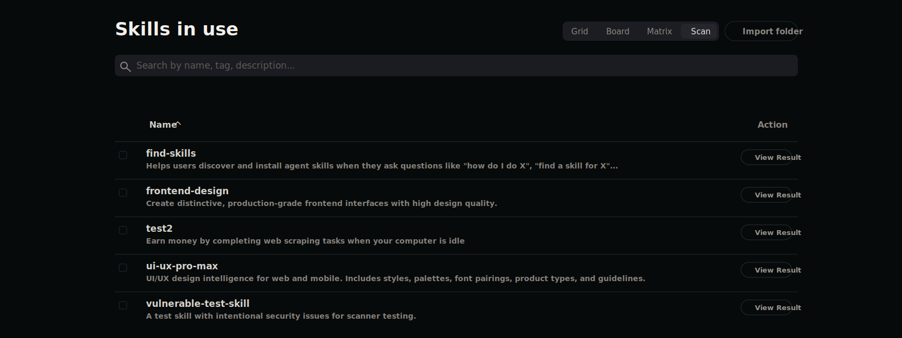
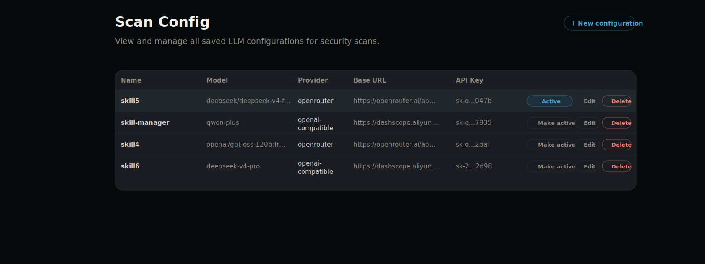

# skill-manager

<p align="center">
  
</p>

<p align="center">
  <strong>A local-first control center for AI extensions.</strong><br />
  Use, review, scan, and discover Skills, Agents, MCP servers, slash commands, hooks, and CLI tools across agent harnesses.
</p>

<p align="center">
  <a href="LICENSE"></a>
  <a href="https://github.com/mode-io/skill-manager/releases/latest"></a>
  <a href="https://www.npmjs.com/package/@mode-io/skill-manager"></a>
  <a href="#install"></a>
  <a href="#install"></a>
  <a href="#local-first-safety"></a>
</p>


## Why it exists

AI extensions are scattered across harness-specific folders, MCP config files, slash command locations, and marketplace sources. Skill Manager gives those pieces one local control surface:

| Product idea | What it means |
|---|---|
| **In use** | Skill Manager controls the item and can enable or disable it across harnesses. |
| **Needs review** | Skill Manager found local state, config differences, or inventory issues that need a decision. |
| **Scan** | Run LLM-backed security checks against Skills before trusting them. |
| **Discover** | Browse marketplaces and preview external tools. |

## What you can do

- See what is in use, what needs review, and where extensions are active.
- Adopt local Skills into one shared inventory, then enable or disable them per harness.
- Scan Skills with a saved LLM provider configuration and review findings before use.
- Install or adopt MCP server configs, resolve differences, and enable them where supported.
- Manage reusable slash commands once, then sync them to supported harnesses.
- Manage hooks as normalized records, then sync them into supported harness settings with drift detection and review for unmanaged entries.
- Define Agents — scoped personas that bundle a prompt, skills, and tool constraints — and "hire" them into supported harnesses with a dry-run preview and an honest report of what each harness can and cannot enforce.
- Keep everything in portable packages: the default `local` package holds your own resources, and additional packages can be dropped in (or deactivated) as a unit.
- Discover Skills, MCP servers, and preview-only CLI tools from marketplace sources.

## Product tour

### Overview

Start with the whole extension portfolio: what is in use, what needs review, what can be discovered, and where extensions are active.


### Skills

Use Skills as shared local packages instead of maintaining separate copies per harness.

Typical flow:

1. Review a Skill found in a harness or install one from the marketplace.
2. Adopt it into the Skill Manager inventory.
3. Enable it only where it should be available.
4. Update, remove, or delete it from one place.


### Skill scanning

Scan Skills with an LLM-backed security review before you rely on them.

Typical flow:

1. In Settings → Scan Config, add and validate an LLM configuration.
2. Switch Skills in use to the Scan view.
3. Run a scan for one Skill, selected Skills, or the full visible list.
4. Review severity, findings, snippets, and remediation guidance.



Scan configurations live under Settings so you can save multiple providers, choose one active configuration, and keep API keys masked in list views.



### MCP servers

Use MCP servers as one normalized config that can be written into each harness shape.

Typical flow:

1. Review an MCP server found in a harness or install one from the marketplace.
2. Adopt it into the Skill Manager inventory.
3. Enable it where the server should be available.
4. Resolve config differences, disable harness bindings, or uninstall it from one place.


### Slash commands

Use slash commands as one shared prompt library instead of rewriting the same command in each harness-specific format.

Typical flow:

1. Create a slash command with a name, description, and prompt.
2. Use `$ARGUMENTS` where runtime input should be inserted.
3. Sync it to supported harnesses.
4. Review existing harness command files and adopt them into the shared library when needed.


### Agents

Define an agent once — a persona with a system prompt, a curated set of skills, tool constraints, and per-harness overrides — then compile ("hire") it into the harness where it should run.

Typical flow:

1. Create an agent in `packages/<package>/agents/<slug>.md` (YAML frontmatter + prompt body), or scaffold one from the Agents page.
2. Reference skills by `<package>/<skill-dir>` alias; they are resolved and pinned at compile time.
3. Pick a target harness and preview the compiled artifact (dry run), including the degradation report — anything the harness cannot enforce is listed instead of silently dropped.
4. Hire: the artifact is written with a provenance marker, and Skill Manager refuses to overwrite files it did not generate.

### Marketplace

Marketplace is the discovery surface:

- **Skills Marketplace**: browse and install Skills.
- **MCP Marketplace**: browse and install MCP servers.
- **CLI Marketplace**: preview external CLI tools from CLIs.dev. This is display-only; Skill Manager does not install or manage CLIs.


## Install

### Homebrew (macOS recommended)

```bash
brew tap mode-io/tap
brew install skill-manager
skill-manager start
```

### npm (macOS ARM64/x64 and Linux x64/ARM64)

```bash
npm install -g @mode-io/skill-manager
skill-manager start
```

The npm wrapper downloads the native release artifact for the current platform and CPU architecture.
Native release artifacts are published on GitHub Releases for macOS ARM64/x64 and Linux x64/ARM64.

## Supported harnesses

<table align="center">
  <tr>
    <td align="center" valign="middle">
      <br />
      <strong>Codex CLI</strong><br />
      <a href="https://developers.openai.com/codex/cli">Docs</a>
    </td>
    <td align="center" valign="middle">
      <br />
      <strong>Claude Code</strong><br />
      <a href="https://code.claude.com/docs/en/overview">Docs</a>
    </td>
    <td align="center" valign="middle">
      <br />
      <strong>Cursor</strong><br />
      <a href="https://cursor.com/docs">Docs</a>
    </td>
    <td align="center" valign="middle">
      <br />
      <strong>OpenCode</strong><br />
      <a href="https://opencode.ai/docs">Docs</a>
    </td>
    <td align="center" valign="middle">
      <br />
      <strong>OpenClaw</strong><br />
      <a href="https://docs.openclaw.ai/start/getting-started">Docs</a>
    </td>
    <td align="center" valign="middle">
      <br />
      <strong>Antigravity (agy)</strong><br />
      <a href="https://antigravity.google">Docs</a>
    </td>
    <td align="center" valign="middle">
      <br />
      <strong>Hermes Agent</strong><br />
      <a href="https://hermes-agent.nousresearch.com/docs">Docs</a>
    </td>
  </tr>
</table>

| Harness | Skills | MCP servers | Slash commands | Hooks |
|---|---:|---:|---:|---:|
| Codex CLI | Yes | Yes | Yes | Yes |
| Claude Code | Yes | Yes | Yes | Yes |
| Cursor | Yes | Yes | Yes | Yes |
| OpenCode | Yes | Yes | Yes | Partial |
| Hermes Agent | Yes | Yes | Yes* | Not Yet |
| OpenClaw | Yes | Not Yet | Not Yet | Not Yet |
| Antigravity (agy) | Yes | Yes | Not Yet | Partial |

<sub>\* Hermes Agent slash-command support is provisional. Its slash-command directory (`~/.hermes/commands`, frontmatter Markdown) follows common conventions but is **not yet verified against a shipping Hermes build**; hooks are not yet mapped. See `handoff.md`.</sub>

## Local-first safety

Skill Manager is a local configuration-management tool. It runs on your machine and reads or writes local harness extension state.

Actions that can change local state include:

- adopting a local skill folder
- enabling or disabling a skill for a harness
- updating a source-backed skill
- removing or deleting a skill
- creating, updating, validating, activating, or deleting an LLM scan configuration
- running a Skill scan, which sends selected Skill context to the configured LLM provider
- installing an MCP server into a selected harness config
- adopting an existing MCP config
- enabling, disabling, resolving, or uninstalling an MCP server
- creating, updating, syncing, importing, or deleting a slash command
- creating, enabling, disabling, resolving, or deleting a hook binding
- changing harness support settings

App-owned files live under `~/.skill-manager` on macOS (with a legacy fallback to `~/Library/Application Support/skill-manager` if it already exists) and XDG base directories on Linux.

## How it works

### Packages

All Skill Manager resources live inside packages under the app's `packages/` directory. Each package carries a `package.json` (`slug`, `name`, `version`, `mutable`, `active`) plus per-family content (`skills/`, `agents/`, and a skills `manifest.json`). There is always a default `local` package — the mutable workspace where your own resources live. Additional packages are just directories: drop one in to install it, set `active: false` to disable it, and mark it `mutable: false` to protect shared content from accidental edits (the API rejects writes into immutable packages).

Resource identity stays stable (content-derived refs), while `<package>/<resource>` aliases give human-readable references; agent compilation resolves aliases and pins them. If two packages provide the same resource, the `local` package wins and the collision is reported as an inventory issue.

On first start after upgrading, the legacy shared store (`shared/` + top-level `manifest.json`) is migrated one-time into `packages/local/` — the migration is locked, idempotent, and skipped when the new layout already exists.

### Skills

Before adoption, each harness points at its own local skill folder. After adoption, Skill Manager keeps one canonical package in its shared local store and exposes it to selected harnesses with local links. Disabling a harness removes that harness binding without deleting the package.

Skill Manager treats managed Skills as portable by default: once a Skill is adopted into the shared store, it can be enabled for any supported harness. `originHarness` is retained only as provenance.

Hermes Agent Skills use the categorized Hermes layout under `~/.hermes/skills/<category>/<skill>/SKILL.md`. Shared Skills enabled for Hermes are linked under the `skill-manager` category by default. Skill Manager only imports Hermes Skills that Hermes itself installed from external hub provenance (`.hub/lock.json` entries that are not official/builtin/optional). Hermes self-learned/local Skills, bundled Skills tracked by `.bundled_manifest`, and official optional Skills recorded in Hermes hub provenance are excluded from Skill Manager inventory and bulk actions; Skill Manager leaves those folders untouched so `hermes update` and Hermes-owned Skill sync keep their normal ownership.


### Skill scans

Skill scans build a bounded prompt context from `SKILL.md`, manifest metadata, script and config files, and files referenced by the Skill instructions. Secret-bearing files such as `.env`, private keys, certificates, and credential files are excluded from the prompt context, and large files are skipped when they exceed scanner limits.

The scanner uses the active saved LLM configuration first. If none is active, it can fall back to supported environment variables such as `ANTHROPIC_API_KEY`, `OPENAI_API_KEY`, `OPENROUTER_API_KEY`, `GEMINI_API_KEY`, `GOOGLE_API_KEY`, `AZURE_OPENAI_API_KEY`, `AWS_BEDROCK_MODEL`, or `OLLAMA_HOST`.

Scan reports show whether the Skill is safe, the maximum severity, findings, locations, snippets, and remediation text. The frontend caches completed reports in browser local storage so recent results remain visible after navigation.

### MCP servers

MCP servers are stored as normalized Skill Manager records, then translated into the config shape each harness expects:

- Codex uses TOML under `mcp_servers`.
- Claude Code and Cursor use `mcpServers` JSON entries.
- OpenCode uses typed local/remote MCP entries.
- Antigravity (agy) uses `mcpServers` JSON entries with `serverUrl` for HTTP transports and `command`/`args`/`env` for stdio.
- Hermes Agent uses YAML under `mcp_servers` in `~/.hermes/config.yaml` (or `$HERMES_HOME/config.yaml`).
- OpenClaw MCP writes are not yet supported.

When Skill Manager finds different configs for the same MCP server, it asks you to resolve the source of truth first.


### Slash commands

Slash commands are stored as TOML records under Skill Manager app storage, then rendered into each supported harness format:

- OpenCode writes Markdown command files under `~/.config/opencode/commands` and invokes them with `/`.
- Claude Code writes Markdown command files under `~/.claude/commands` and invokes them with `/`.
- Cursor writes plain text command files under `~/.cursor/commands` and invokes them with `/`.
- Codex writes prompt files under `~/.codex/prompts` and invokes them with `/prompts:`.
- Hermes Agent writes Markdown command files under `~/.hermes/commands` and invokes them with `/` (provisional).
- OpenClaw and Antigravity (agy) slash command writes are not yet supported.

Skill Manager tracks target ownership with sync state and content hashes. It will not overwrite an untracked command file automatically, and it reports managed files as changed or missing when the target no longer matches the last synced hash. Review actions let you adopt unmanaged commands, restore managed content, adopt a changed harness command as the new source, or remove a broken binding while leaving the harness file untouched.

### Hooks

Hooks are stored as normalized Skill Manager records using **canonical events** (`pre_tool_use`, `post_tool_use`, `user_prompt_submit`, `session_start`, `stop`, `pre_compact`) and **canonical tool categories** (`shell`, `file_read`, `file_write`, `mcp`, `web`, `any`). Each harness codec translates a canonical record into that harness's native event names and config shape, and merges it into the harness's hook config:

- Claude Code writes hook entries into `~/.claude/settings.json` under the `hooks` key.
- Codex writes inline `[hooks]` tables into `~/.codex/config.toml` (same event schema as Claude).
- Cursor writes `~/.cursor/hooks.json`, expressing each tool category as its dedicated event (`beforeShellExecution`, `afterFileEdit`, `beforeMCPExecution`, and so on).
- OpenCode writes `experimental.hook` entries in `opencode.json` — limited to `file_edited` (post-edit on write) and `session_completed` (stop), so coverage is partial.
- Antigravity (agy) writes a name-keyed `~/.gemini/config/hooks.json`, matching against its own tool names (`run_command`, `view_file`, …); it covers tool, stop, and (via `PreInvocation`) prompt-submit hooks, so coverage is partial.

Because harnesses differ, not every canonical event maps to every harness. Skill Manager exposes a **representability matrix** showing where each hook can sync and where it cannot, including caveats — for example, an Antigravity `user_prompt_submit` hook maps to `PreInvocation`, which fires before every model invocation rather than only on prompt submit.

Skill Manager owns only the specific hook entries it writes. It merges into each harness's config without disturbing hooks or other keys it does not manage, and it tracks ownership with content hashes. When a managed hook is edited outside Skill Manager it is reported as drifted, and hooks found in a harness that Skill Manager does not manage are reported as unmanaged for review.

### Agents

Agents are Markdown files with YAML frontmatter in a package's `agents/` directory: a name and description, `capabilities` (skill aliases, MCP references, tool allow/deny lists), optional per-harness overrides (model, reasoning effort), and the persona prompt as the body.

Compiling ("hiring") an agent renders a harness-specific artifact:

- Claude Code: `~/.claude/agents/<slug>.md` — frontmatter carries the tool allowlist and model/reasoning overrides; referenced skills are embedded in full.
- Cursor: `<project>/.cursor/rules/skill-manager.<slug>.mdc` — rules are project-scoped, so a project directory is required; Skill Manager never touches `.cursorrules`.
- Codex: `~/.codex/prompts/<slug>.md` — compiled as a custom prompt invoked with `/`, since Codex has no agent-definition file Skill Manager can own without overwriting user `AGENTS.md`.

Every artifact embeds a provenance marker (agent ref, definition hash, pinned skill revisions). Skill Manager only overwrites files carrying that marker — hand-written files are never clobbered. Constraints a harness cannot enforce (tool deny-lists everywhere, any tool lists on Cursor/Codex, model overrides outside Claude) are surfaced as **degradation notes** in the compile response and the Hire preview, never silently dropped.

### CLIs

CLI marketplace entries are preview-only.

## Configuration

On macOS, app-owned files live under `~/.skill-manager` (with a legacy fallback to `~/Library/Application Support/skill-manager` if it already exists). On Linux, app-owned files use XDG base directories.

Useful macOS paths:

- packages root: `~/.skill-manager/packages` (default package: `packages/local`)
- shared skills store: `~/.skill-manager/packages/local/skills` (migrated from the legacy `~/.skill-manager/shared` on first start)
- agents: `~/.skill-manager/packages/<package>/agents`
- MCP manifest: `~/.skill-manager/mcp/manifest.json`
- hooks manifest: `~/.skill-manager/hooks/manifest.json`
- slash command library: `~/.skill-manager/slash-commands/commands`
- slash command sync state: `~/.skill-manager/slash-commands/sync-state.json`
- marketplace cache: `~/.skill-manager/marketplace`
- app database and LLM scan configs: `~/.skill-manager/skill-manager.db`
- app settings: `~/.skill-manager/settings.json`

Useful Linux paths:

- packages root: `${XDG_DATA_HOME:-~/.local/share}/skill-manager/packages`
- shared skills store: `${XDG_DATA_HOME:-~/.local/share}/skill-manager/packages/local/skills`
- agents: `${XDG_DATA_HOME:-~/.local/share}/skill-manager/packages/<package>/agents`
- MCP manifest: `${XDG_DATA_HOME:-~/.local/share}/skill-manager/mcp/manifest.json`
- hooks manifest: `${XDG_DATA_HOME:-~/.local/share}/skill-manager/hooks/manifest.json`
- slash command library: `${XDG_DATA_HOME:-~/.local/share}/skill-manager/slash-commands/commands`
- slash command sync state: `${XDG_DATA_HOME:-~/.local/share}/skill-manager/slash-commands/sync-state.json`
- marketplace cache: `${XDG_DATA_HOME:-~/.local/share}/skill-manager/marketplace`
- app database and LLM scan configs: `${XDG_DATA_HOME:-~/.local/share}/skill-manager/skill-manager.db`
- app settings: `${XDG_CONFIG_HOME:-~/.config}/skill-manager/settings.json`

Most users do not need to change these locations. If you manage skills in a custom environment, you can override individual skill roots with environment variables.

| Harness | Env var | Default Skill Manager skill root |
|---|---|---|
| Codex | `SKILL_MANAGER_CODEX_ROOT` | `~/.agents/skills` |
| Claude | `SKILL_MANAGER_CLAUDE_ROOT` | `~/.claude/skills` |
| Cursor | `SKILL_MANAGER_CURSOR_ROOT` | `~/.cursor/skills` |
| OpenCode | `SKILL_MANAGER_OPENCODE_ROOT` | `~/.config/opencode/skills` |
| Hermes Agent | `SKILL_MANAGER_HERMES_ROOT` | `${HERMES_HOME:-~/.hermes}/skills` |
| OpenClaw | `n/a` | `~/.openclaw/skills` |
| Antigravity (agy) | `SKILL_MANAGER_AGY_ROOT` | `~/.gemini/antigravity-cli/skills` |

MCP config locations are harness-owned. Skill Manager writes only to verified config paths and skips unsupported harness writes. Hermes Agent config discovery honors `SKILL_MANAGER_HERMES_HOME` first, then `HERMES_HOME`, then `~/.hermes`.

## From source

### Requirements

- Python 3.11+
- Node.js 18+
- npm

`skill-manager` supports Python 3.11+. CI validates backend compatibility on Python 3.11 through 3.14, while packaging and release builds stay pinned to Python 3.11 for determinism.

### Contributor setup

```bash
scripts/install-dev.sh
```

### Run locally

```bash
scripts/start-dev.sh
```

Stop the managed local instance:

```bash
scripts/stop-dev.sh
```

The split dev flow is available when you want Vite hot reload:

```bash
npm run dev
npm run dev:backend
```

Default local URLs:

- Frontend: `http://127.0.0.1:5173`
- Backend: `http://127.0.0.1:8000`
- Health: `http://127.0.0.1:8000/api/health`

Validation:

```bash
scripts/install-dev.sh
npm run typecheck
bash scripts/test_backend.sh
npm test
npm run build
```

## Troubleshooting

- If Marketplace requests fail with `Marketplace is temporarily unavailable`, verify your network connection and try again.
- On macOS, if `npm install -g @mode-io/skill-manager` reports that Homebrew already owns `skill-manager`, uninstall the Homebrew formula first. The inverse also applies: uninstall the npm package before switching back to Homebrew.
- If an MCP harness is shown as unavailable, Skill Manager has detected that the local client is missing or does not support the required config surface.

## More to come

### Extension families

- [x] Hook support
- [x] Slash command support
- [x] Agent personas (define once, hire into Claude Code / Cursor / Codex)
- [x] Package-based storage (portable resource bundles)
- [ ] Plugin support
- [ ] Agent-scoped MCP compilation
- [ ] Compiled-artifact drift detection surfacing

### Harness expansion

- [ ] GitHub Copilot
- [ ] Gemini CLI
- [ ] Cline
- [ ] Windsurf
- [ ] Qwen Code
- [ ] Kimi Code
- [ ] Qoder

## Community

- See [CONTRIBUTING.md](CONTRIBUTING.md) for contribution guidelines.
- See [SECURITY.md](SECURITY.md) to report vulnerabilities privately.
